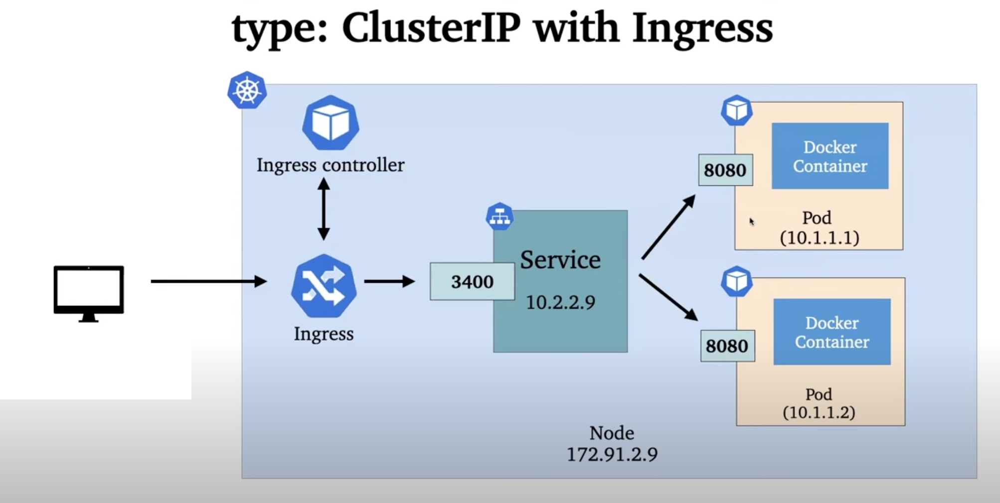

# Run simple Spring Boot app in Kubernetes with Ingress



### Steps

#### Create helm config
```shell
helm create kubechart # create config directory kubechart
```

#### Change values in ./kubechart/values.yaml
+ image section repository and tag
+ service section type and port

#### Run minikube
```shell
minikube start --driver=docker
```

#### Set and Deploy
```shell
kubectl get nodes
kubectl get services
eval $(minikube docker-env) # search image localy
docker build -t springboot-on-minikube .
minikube image ls # check created image in minikube docker registry
helm install mychart kubechart # deploy
kubectl get pods # check deploy
kubectl get services
minikube ip # get ip
minikube service mychart-kubechart --url # get url
minikube addons enable ingress
kubectl get pods -n ingress-nginx # check ingress
```

change values.yaml 
+ `ingress.enabled` to `true`
+ `ingress.hosts.host`
+ pathType to Prefix
+ serviceType to ClusterIP

```shell
helm upgrade mychart kubechart/
kubectl get ingress
sudo vi /etc/hosts # add line 127.0.0.1       chart-example.com
minikube tunnel # check via ingress http://chart-example.com/check
helm template kubechart # check helm config
helm list
```